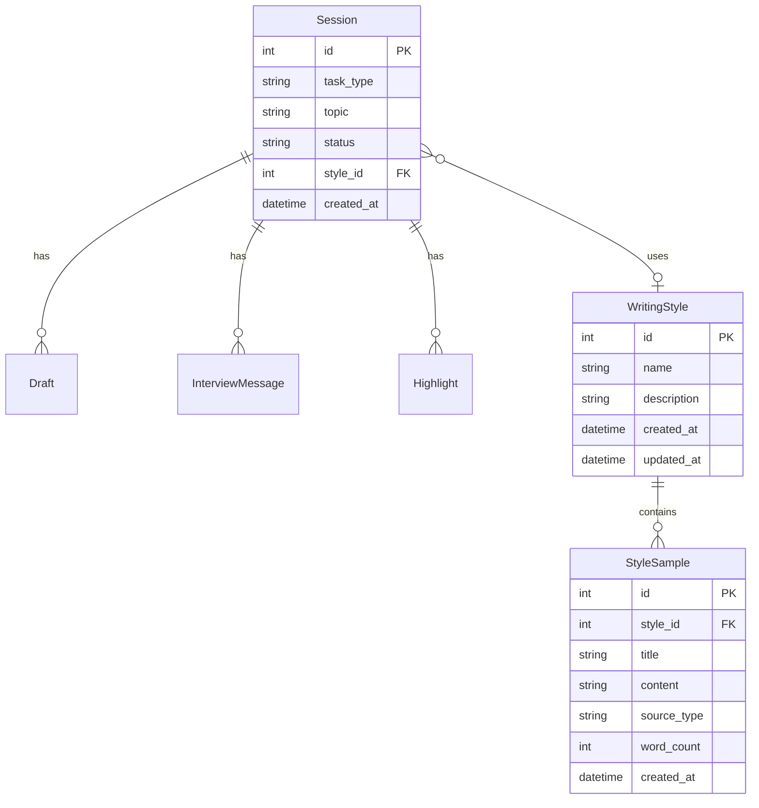

# Inkwell: Rebrand with Sidebar, Voice Input, and Style Management

## Enhancement Summary

**Deepened on:** 2026-02-18
**Sections enhanced:** 7 phases + cross-cutting concerns
**Review agents used:** Architecture Strategist, Security Sentinel, Performance Oracle, Frontend Design, Best Practices Researcher

### Key Improvements
1. Moved `style_id` wiring and `session.cancel` to earlier phases (architecture fix)
2. Added comprehensive security hardening: file upload limits, filename sanitization, token rate limiting, WebSocket origin checks
3. AudioWorklet-based voice capture (off main thread) replaces naive MediaRecorder approach
4. N+1 session list query fixed with single JOIN + pagination
5. Detailed CSS specs for all new components following Editorial Darkroom conventions
6. Task cancellation protocol with stored `asyncio.Task` references

### New Considerations Discovered
- Drop `assemblyai` SDK — use direct `httpx` call for token generation (avoids heavy dependency)
- Cap total style sample context at 3000 words / 5 samples in prompts
- Split screen state into `appView` (session/styles) + `sessionScreen` (task/interview/drafts/focus) to preserve breadcrumb semantics
- AssemblyAI temp tokens are single-use — need new token on reconnect

---

## Overview

Rebrand the app from "Proof Editor" to **Inkwell** and build the Spiral-inspired UI features: a persistent left sidebar with session history and style management, a "What are we writing today?" home experience with voice input via AssemblyAI, and document/folder upload for style learning. Keep the existing Editorial Darkroom design system (dark chrome, warm paper, Outfit + Newsreader fonts, orange accent).

**Name rationale**: "Inkwell" evokes classic editorial craft — dipping into the well to write. It's warm, memorable, and fits the darkroom aesthetic. Short enough for a logo, distinctive enough to search.

## Screenshots Reference

Three Spiral UI screenshots inform this plan:

1. **Sidebar + Styles Home**: Left sidebar with "New writing session", "Styles" nav, "Workspaces" section, session "History" list. Main area: "Create a Writing Style" CTA.
2. **Style Creation**: "Style name here" input + 4 source cards (Upload documents, Paste raw text, Import from X/Twitter, Import from LinkedIn).
3. **New Session**: "What are we writing today, Sam?" headline with text input, mic button, "Create style" chip, "Start writing" button.

## Problem Statement

The current app has:
- No persistent sidebar — sessions are listed at the bottom of TaskSelector
- No voice input — only text
- No style management UI — writing examples loaded from `inspo/` folder manually
- No document upload — files must be placed on disk
- "Proof Editor" branding that needs to change

## Proposed Solution

7 phases, each independently shippable. Phases 1-3 are structural (sidebar, rename, home). Phases 4-6 are features (voice, styles, upload). Phase 7 is polish.

---

## Cross-Cutting: Architecture Changes

These apply across multiple phases and should be implemented first.

### Split Screen State

The current `session.screen` type (`'task' | 'interview' | 'drafts' | 'focus'`) is a linear workflow. Adding `'styles'` and `'style_editor'` pollutes this. Split into two concerns:

```typescript
// session.svelte.ts
appView = $state<'session' | 'styles' | 'style_editor'>('session');
sessionScreen = $state<'task' | 'interview' | 'drafts' | 'focus'>('task');
currentSessionId = $state<number | null>(null);
```

The breadcrumb only renders when `appView === 'session'`. On styles screens, show contextual back-arrow navigation instead.

### Extract Session Routes

Before adding new routers, move existing session endpoints from `main.py` into `api/sessions.py` for consistency. All route files follow the same pattern: `APIRouter` prefix, mounted in `main.py`.

### Define BASE_API_URL

```typescript
// frontend/src/lib/config.ts
export const BASE_API_URL = 'http://localhost:8000';
export const BASE_WS_URL = 'ws://localhost:8000/ws';
```

All `fetch()` calls use this constant. Currently hardcoded in multiple files.

### Bind to 127.0.0.1

Change `host="0.0.0.0"` to `host="127.0.0.1"` in `main.py` to prevent network exposure. No auth system means anyone on the network can access everything.

---

## Technical Approach

### Phase 1: App Sidebar Layout + Session Cancel Protocol

Restructure `+page.svelte` from single-column to sidebar + main content. Also implement `session.cancel` (required for sidebar session switching).

**Files:**
- `frontend/src/lib/components/Sidebar.svelte` (new)
- `frontend/src/routes/+page.svelte` (edit layout structure)
- `frontend/src/lib/stores/session.svelte.ts` (edit — add session list, appView, currentSessionId)
- `frontend/src/lib/config.ts` (new — BASE_API_URL)
- `backend/src/proof_editor/api/sessions.py` (new — extracted from main.py)
- `backend/src/proof_editor/ws_types.py` (edit — add SessionCancel)
- `backend/src/proof_editor/agent/orchestrator.py` (edit — add handle_cancel, _active_tasks)

**Layout change:**

```
BEFORE:                          AFTER:
┌─────────────────────┐         ┌────────┬──────────────┐
│      topbar         │         │        │   topbar     │
├─────────────────────┤         │sidebar ├──────────────┤
│                     │         │        │              │
│   main content      │         │        │ main content │
│                     │         │        │              │
└─────────────────────┘         └────────┴──────────────┘
```

**Sidebar.svelte CSS:**
```css
.sidebar {
  width: 240px;
  min-width: 240px;
  height: 100vh;
  background: #16161a; /* 2 stops darker than --chrome to separate visually */
  background-image: linear-gradient(
    180deg,
    rgba(232, 115, 58, 0.03) 0%,
    transparent 120px
  ); /* whisper of accent warmth behind logo */
  border-right: 1px solid var(--chrome-border);
  display: flex;
  flex-direction: column;
  transition: transform 0.2s ease-out;
  overflow: hidden;
}

/* Mobile: slide overlay */
@media (max-width: 768px) {
  .sidebar {
    position: fixed;
    left: 0;
    top: 0;
    z-index: 100;
    width: 240px;
  }
  .sidebar.collapsed {
    transform: translateX(-100%);
  }
}
```

**Logo: Newsreader italic** (not Outfit — reinforces editorial identity):
```css
.sidebar-logo {
  font-family: 'Newsreader', serif;
  font-style: italic;
  font-weight: 600;
  font-size: 22px;
  color: var(--chrome-text);
  letter-spacing: -0.01em;
}
```

**Session items:**
```css
.session-item {
  padding: 10px 16px 10px 12px;
  border-left: 3px solid transparent;
  transition: border-color 0.2s, background 0.2s;
  cursor: pointer;
}
.session-item.active {
  border-left-color: var(--accent);
  background: rgba(232, 115, 58, 0.06);
}
.session-type { /* above topic */
  font-size: 10px; font-weight: 600; text-transform: uppercase;
  letter-spacing: 0.06em; color: var(--chrome-text-muted);
}
.session-topic {
  font-size: 13px; font-weight: 500; color: var(--chrome-text);
  white-space: nowrap; overflow: hidden; text-overflow: ellipsis;
}
```

**Section labels** (HISTORY, etc.): `11px`, `font-weight: 600`, `letter-spacing: 0.06em`, `color: var(--chrome-text-muted)` — matches existing convention.

**"+ New session" button**: text-style with accent color (not filled), matching Spiral reference:
```css
.new-session-btn {
  display: flex; align-items: center; gap: 8px;
  padding: 8px 14px; color: var(--accent);
  font-size: 13px; font-weight: 600;
  background: transparent; border: none; border-radius: 8px;
  cursor: pointer; width: 100%; text-align: left;
}
.new-session-btn:hover { background: rgba(232, 115, 58, 0.08); }
```

**Remove light/dark toggle** from sidebar — Editorial Darkroom IS the brand. Not scoped for MVP.

**Session cancel protocol:**
```python
# ws_types.py
class SessionCancel(BaseModel):
    type: Literal["session.cancel"] = "session.cancel"

# orchestrator.py
class Orchestrator:
    _active_tasks: list[asyncio.Task] = []

    async def handle_cancel(self):
        for task in self._active_tasks:
            task.cancel()
        self._active_tasks = []
        self.state = "idle"
```

**Session list query: fix N+1** (current code runs 2 queries per session):
```python
# api/sessions.py
stmt = (
    select(
        Session.id, Session.task_type, Session.topic,
        Session.status, Session.created_at,
        func.count(Draft.id).label("draft_count"),
        func.coalesce(func.max(Draft.round), 0).label("max_round"),
    )
    .outerjoin(Draft, Draft.session_id == Session.id)
    .group_by(Session.id)
    .order_by(Session.created_at.desc())
    .limit(50)
)
```

Add `index=True` to `Draft.session_id` and `Session.created_at`.

**Acceptance Criteria:**
- [ ] Sidebar renders with session history from API (single JOIN query)
- [ ] Click session to resume (sends `session.cancel` then `session.resume`)
- [ ] "New session" button resets to task selector (sends `session.cancel` first)
- [ ] Sidebar shows on desktop, slides out on mobile (<768px) with backdrop overlay
- [ ] Current session highlighted with accent left-border
- [ ] Topbar moves inside main content area (not above sidebar)
- [ ] `session.cancel` aborts in-flight LLM calls via task cancellation
- [ ] Empty state: "No sessions yet" text
- [ ] Loading state: skeleton lines
- [ ] Breadcrumb hidden on non-session screens (styles, style_editor)

---

### Phase 2: Rebrand to Inkwell

Rename all user-facing "Proof" references to "Inkwell". Keep Python module name `proof_editor`.

**Files to edit:**
- `frontend/src/routes/+page.svelte` — `<title>Inkwell</title>`, remove old logo
- `frontend/src/lib/components/Sidebar.svelte` — logo in sidebar header
- `backend/src/proof_editor/main.py` — `FastAPI(title="Inkwell")`
- `CLAUDE.md` — update overview section (keep "proof_editor" for code paths)

**NOT renaming (intentional):**
- Python package `proof_editor` (too many import changes, no user impact)
- Database file `proof_editor.db` (migration not worth it)
- Directory names `backend/src/proof_editor/` (internal)

**Acceptance Criteria:**
- [ ] Browser tab shows "Inkwell"
- [ ] Sidebar logo shows "Inkwell" in Newsreader italic 600
- [ ] API title shows "Inkwell" at `/docs`
- [ ] No user-visible "Proof" references remain
- [ ] Favicon updated (accent-colored ink droplet SVG)

---

### Phase 3: "What Are We Writing Today?" Home Screen

Rewrite `TaskSelector.svelte` with the Spiral-inspired centered prompt.

**File:** `frontend/src/lib/components/TaskSelector.svelte` (rewrite)

**Layout — unified input card:**

```
              What are we writing today?

    ┌──────────────────────────────────────────────┐
    │ I'm writing a piece about...            🎙   │
    │                                              │
    ├──────────────────────────────────────────────┤
    │ Essay  Review  Newsletter  Blog  Landing     │  ← task pills (inside card)
    ├──────────────────────────────────────────────┤
    │ + │ Create style │ Style: None  Start writing│  ← toolbar
    └──────────────────────────────────────────────┘
```

**Accent highlight on "writing":**
```css
.headline-accent {
  background: var(--accent);
  color: white;
  padding: 2px 10px;
  border-radius: 6px;
  display: inline-block;
  line-height: 1.2;
}
```

**Unified input card** (textarea + pills + toolbar as one container):
```css
.input-card {
  width: 100%; max-width: 560px;
  background: var(--paper);
  border: 1px solid var(--paper-border);
  border-radius: 16px;
  overflow: hidden;
  box-shadow: 0 2px 16px rgba(0, 0, 0, 0.12);
}
.input-card textarea {
  width: 100%; border: none; background: transparent;
  padding: 20px 24px 12px;
  font-family: 'Newsreader', serif;
  font-size: 17px; line-height: 1.6; color: var(--ink);
  resize: none; min-height: 80px;
}
.input-card textarea:focus { outline: none; }
```

**Keep task type pills** (inside card, below textarea) — auto-detection as default, but visible for override:
```css
.task-pills {
  display: flex; flex-wrap: wrap; gap: 6px; padding: 0 20px 8px;
}
.task-pill {
  padding: 4px 12px; border-radius: 16px;
  border: 1px solid var(--paper-border); background: transparent;
  color: var(--ink-muted); font-size: 12px; font-weight: 500;
  cursor: pointer; transition: all 0.15s;
}
.task-pill.selected {
  background: var(--accent); color: white; border-color: var(--accent);
}
```

**"Start writing" button — pill shape, right-aligned in toolbar:**
```css
.start-writing-btn {
  margin-left: auto;
  padding: 6px 18px; background: var(--accent); color: white;
  border: none; border-radius: 20px;
  font-size: 13px; font-weight: 600; cursor: pointer;
}
```

**User name**: `INKWELL_USER_NAME` env var served via `GET /api/settings`. Default: no name shown.

**Acceptance Criteria:**
- [ ] Centered headline with accent-highlighted "writing" word
- [ ] Unified input card: paper background, serif textarea, task pills, toolbar
- [ ] Task type pills inside card (auto-selected from keywords, user-overridable)
- [ ] Toolbar: +, mic, "Create style" chip, style selector, "Start writing" pill
- [ ] Staggered entrance animation preserved
- [ ] Session list removed (now in sidebar)
- [ ] Radial gradient background centered on card

---

### Phase 4: AssemblyAI Voice Input

Add microphone dictation. Architecture: backend generates temp token via direct HTTP (no SDK), frontend connects directly to AssemblyAI WebSocket, AudioWorklet captures audio off-thread.

**New files:**
- `frontend/src/lib/components/VoiceButton.svelte` (new)
- `frontend/src/lib/audio-capture.svelte.ts` (new — AudioWorklet setup)
- `frontend/src/lib/transcription.svelte.ts` (new — AssemblyAI WS client)
- `frontend/static/pcm-recorder-processor.js` (new — AudioWorklet processor)
- `backend/src/proof_editor/api/voice.py` (new)

**No `assemblyai` SDK dependency** — use direct `httpx` call for token (avoids heavy dep):
```python
# api/voice.py
import httpx, os
from fastapi import APIRouter, HTTPException
from datetime import datetime

router = APIRouter()
_last_token_time: datetime | None = None

@router.get("/api/voice/token")
async def create_voice_token() -> dict[str, str]:
    """Generate a temporary AssemblyAI token (60s lifetime, rate-limited)."""
    global _last_token_time
    now = datetime.now()
    if _last_token_time and (now - _last_token_time).total_seconds() < 10:
        raise HTTPException(429, "Token rate limited — try again in 10s")
    _last_token_time = now

    async with httpx.AsyncClient() as client:
        resp = await client.get(
            "https://streaming.assemblyai.com/v3/token",
            params={"expires_in_seconds": 60},
            headers={"Authorization": os.environ["ASSEMBLYAI_API_KEY"]},
        )
        resp.raise_for_status()
        return {"token": resp.json()["token"]}
```

**Environment variable:** `ASSEMBLYAI_API_KEY` in `.env`

**AudioWorklet processor** (`static/pcm-recorder-processor.js`):
```javascript
class PCMRecorderProcessor extends AudioWorkletProcessor {
  process(inputs) {
    if (inputs.length > 0 && inputs[0].length > 0) {
      this.port.postMessage(new Float32Array(inputs[0][0]));
    }
    return true;
  }
}
registerProcessor("pcm-recorder-processor", PCMRecorderProcessor);
```

**Audio capture** (`audio-capture.svelte.ts`):
- `AudioContext({ sampleRate: 16000 })` — forces hardware resampling to 16kHz
- AudioWorklet captures PCM off main thread
- Converts Float32 → PCM16 (Int16Array) before sending

**AssemblyAI WebSocket** (`transcription.svelte.ts`):
- Connects to `wss://streaming.assemblyai.com/v3/ws?sample_rate=16000&token={token}&format_turns=true`
- Sends audio as binary WebSocket frames (not base64)
- Receives `Begin`, `Turn` (partial/final), `Termination` events
- Token is **single-use** — new token needed on every reconnect

**VoiceButton.svelte — 4-state machine:**
```typescript
type VoiceState =
  | { status: 'idle' }
  | { status: 'requesting' }      // permission dialog open
  | { status: 'recording'; partialText: string; finalText: string }
  | { status: 'error'; message: string };
```

**Recording indicator — accent orange expanding ring** (not red dot):
```css
.voice-btn.recording {
  background: var(--accent);
  border-color: var(--accent);
  color: white;
  animation: voicePulse 1.5s ease-in-out infinite;
}
@keyframes voicePulse {
  0% { box-shadow: 0 0 0 0 rgba(232, 115, 58, 0.4); }
  70% { box-shadow: 0 0 0 8px rgba(232, 115, 58, 0); }
  100% { box-shadow: 0 0 0 0 rgba(232, 115, 58, 0); }
}
```

**Partial transcript display**: Show inside textarea as live-appending text with `color: var(--accent-soft)` for in-progress, changing to `var(--ink)` on finalization.

**Props**: Pass `onTranscript: (text: string) => void` callback to VoiceButton (not store-writes-to-textarea pattern). Keeps voice store decoupled from consumers.

**Browser support check:**
```typescript
export function checkVoiceSupport(): { supported: boolean; reason?: string } {
  if (!navigator.mediaDevices?.getUserMedia)
    return { supported: false, reason: "No microphone support" };
  if (typeof AudioWorkletNode === "undefined")
    return { supported: false, reason: "Browser too old" };
  return { supported: true };
}
```

**Acceptance Criteria:**
- [ ] Mic button in task selector toolbar and interview textarea
- [ ] Click to start recording, click again to stop
- [ ] 4-state UI: idle, requesting (permission), recording (orange pulse), error
- [ ] AudioWorklet captures audio off main thread at 16kHz
- [ ] Binary PCM16 chunks sent directly to AssemblyAI WebSocket
- [ ] Partial transcripts visible in accent-soft color during recording
- [ ] Final transcripts appended to textarea in ink color
- [ ] Graceful error: "Microphone access denied" with retry button
- [ ] Recording stops on screen transition ($effect cleanup)
- [ ] Token rate-limited (10s cooldown)
- [ ] Voice support check hides mic button on unsupported browsers

---

### Phase 5: Writing Style Management + Drafting Integration

Create and manage writing styles. **Includes style_id wiring to sessions and drafting** (moved from Phase 7).

**New files:**
- `frontend/src/lib/components/StyleManager.svelte` (new)
- `frontend/src/lib/components/StyleEditor.svelte` (new)
- `frontend/src/lib/stores/styles.svelte.ts` (new)
- `backend/src/proof_editor/models/style.py` (new)
- `backend/src/proof_editor/api/styles.py` (new)

**Backend dependency:**
```bash
cd backend && uv add python-multipart
```

**Backend models** (`models/style.py`):
```python
class WritingStyle(SQLModel, table=True):
    __tablename__ = "writing_style"  # explicit, readable table name
    id: int | None = Field(default=None, primary_key=True)
    name: str = Field(index=True, max_length=200)
    description: str = Field(default="", max_length=2000)
    created_at: datetime = Field(default_factory=datetime.utcnow)
    updated_at: datetime = Field(default_factory=datetime.utcnow)

class StyleSample(SQLModel, table=True):
    __tablename__ = "style_sample"
    id: int | None = Field(default=None, primary_key=True)
    style_id: int = Field(foreign_key="writing_style.id", index=True)
    title: str = Field(default="", max_length=500)
    content: str
    source_type: str  # Validated: "upload" | "paste"
    word_count: int = 0
    created_at: datetime = Field(default_factory=datetime.utcnow)
```

**Session model update:**
```python
# Add to Session model
style_id: int | None = Field(default=None, foreign_key="writing_style.id")
```

DB recreation required (pre-launch). Document in CLAUDE.md.

**Backend endpoints** (`api/styles.py`) — with security hardening:
```
GET    /api/styles                → list all styles
POST   /api/styles                → create style (name, description) — validate lengths
GET    /api/styles/{id}           → get style with samples
PUT    /api/styles/{id}           → update name/description — saves on blur
DELETE /api/styles/{id}           → cascade delete style + all samples

POST   /api/styles/{id}/samples          → add sample (paste text)
POST   /api/styles/{id}/samples/upload   → upload document (Phase 6 adds PDF)
DELETE /api/styles/{id}/samples/{sid}     → remove sample
```

**Security on upload endpoint:**
```python
MAX_UPLOAD_BYTES = 5 * 1024 * 1024  # 5 MB
ALLOWED_EXTENSIONS = {".txt", ".md", ".pdf"}
ALLOWED_MIMES = {"text/plain", "text/markdown", "application/pdf"}

# Sanitize filename
from pathlib import PurePosixPath
safe_name = PurePosixPath(file.filename or "untitled").name

# Validate encoding
try:
    text = raw_bytes.decode("utf-8")
except UnicodeDecodeError:
    raise HTTPException(400, "File must be valid UTF-8 text")
```

**Style context cap for prompts:**
```python
MAX_STYLE_TOKENS = 3000  # ~3000 words

def format_style_samples(samples: list[StyleSample], max_words: int = 3000) -> str:
    parts, total = [], 0
    for s in samples:
        words = s.content.split()
        take = min(len(words), 500, max_words - total)
        if take <= 0:
            break
        parts.append(f"--- {s.title} ({take} words) ---")
        parts.append(" ".join(words[:take]))
        total += take
    return "\n\n".join(parts)
```

Cache formatted style context on Orchestrator instance at session start, reuse across synthesis rounds.

**WebSocket protocol — style_id on task.select:**
```python
# ws_types.py
class TaskSelect(BaseModel):
    type: Literal["task.select"] = "task.select"
    task_type: str
    topic: str
    style_id: int | None = None  # backward compatible
```

**Frontend StyleManager.svelte — uses paper treatment for style cards:**
```css
.style-card {
  background: var(--paper); border: 1px solid var(--paper-border);
  border-radius: 12px; padding: 20px; cursor: pointer;
  transition: border-color 0.2s, box-shadow 0.2s;
}
.style-card:hover {
  border-color: var(--accent);
  box-shadow: 0 2px 12px rgba(232, 115, 58, 0.08);
}
.style-card-name { font-family: 'Newsreader', serif; font-size: 18px; color: var(--ink); }
```

**StyleEditor — source cards on chrome-surface** (actions, not content):
```css
.source-card {
  background: var(--chrome-surface); border: 1px solid var(--chrome-border);
  border-radius: 12px; padding: 20px 16px; text-align: center;
}
.source-card:hover { border-color: var(--accent); background: rgba(232, 115, 58, 0.04); }
```

**Style name — Newsreader italic, inline editable, saves on blur:**
```css
.style-name-input {
  font-family: 'Newsreader', serif; font-style: italic;
  font-size: 32px; color: var(--chrome-text);
  background: transparent; border: none; text-align: center;
}
.style-name-input:focus { border-bottom: 1px solid var(--chrome-border); }
```

**Sample items — paper palette:**
```css
.sample-item {
  background: var(--paper); border: 1px solid var(--paper-border);
  border-radius: 10px; padding: 14px 20px;
}
.sample-title { font-family: 'Newsreader', serif; font-size: 15px; color: var(--ink); }
```

**Navigation:**
- Sidebar "Styles" link → `appView = 'styles'` → renders StyleManager
- "Create" or card click → `appView = 'style_editor'` → renders StyleEditor
- Back arrow → returns to StyleManager
- Task selector "Create style" chip → creates new style + navigates to StyleEditor

**Acceptance Criteria:**
- [ ] "Styles" link in sidebar navigates to StyleManager
- [ ] Create new style (default name "Untitled Style", inline editable)
- [ ] Add samples via paste text (inline textarea)
- [ ] Add samples via file upload (txt, md — validated)
- [ ] View style with sample list on paper cards
- [ ] Delete individual samples (with confirmation)
- [ ] Delete entire style (with confirmation, cascade deletes samples)
- [ ] Style selector visible in task input toolbar
- [ ] `style_id` sent with `task.select` WebSocket message
- [ ] Style samples injected into drafting prompts (capped at 3000 words)
- [ ] Fallback to `inspo/` examples when no style selected
- [ ] Back navigation from StyleEditor
- [ ] Empty style warning on selection: "No samples yet"

---

### Phase 6: Document Upload Enhancement

Extend file upload to support PDF and folder upload.

**Backend dependency:**
```bash
cd backend && uv add pymupdf
```

**PDF extraction — in thread pool with safety guards:**
```python
import fitz  # pymupdf
import asyncio

async def extract_pdf_text_async(data: bytes, max_pages: int = 100) -> str:
    return await asyncio.to_thread(_extract_pdf_text, data, max_pages)

def _extract_pdf_text(data: bytes, max_pages: int) -> str:
    doc = fitz.open(stream=data, filetype="pdf")
    if len(doc) > max_pages:
        doc.close()
        raise ValueError(f"PDF has {len(doc)} pages, max {max_pages}")
    parts, total_len = [], 0
    for page in doc:
        t = page.get_text()
        total_len += len(t)
        if total_len > 1_000_000:  # 1MB text cap
            break
        parts.append(t)
    doc.close()
    return "\n".join(parts)
```

**Upload endpoint with full validation:**
```python
@router.post("/api/styles/{style_id}/samples/upload")
async def upload_sample(style_id: int, file: UploadFile):
    # 1. Sanitize filename
    safe_name = PurePosixPath(file.filename or "untitled").name
    ext = PurePosixPath(safe_name).suffix.lower()

    # 2. Validate extension + MIME
    if ext not in ALLOWED_EXTENSIONS:
        raise HTTPException(400, f"Unsupported file type: {ext}")

    # 3. Read with size limit
    content = bytearray()
    while chunk := await file.read(8192):
        content.extend(chunk)
        if len(content) > MAX_UPLOAD_BYTES:
            raise HTTPException(413, "File exceeds 5 MB limit")

    # 4. Extract text
    if ext == ".pdf":
        text = await extract_pdf_text_async(bytes(content))
    else:
        try:
            text = bytes(content).decode("utf-8")
        except UnicodeDecodeError:
            raise HTTPException(400, "File must be valid UTF-8")

    # 5. Save sample
    sample = StyleSample(
        style_id=style_id, title=safe_name, content=text,
        source_type="upload", word_count=len(text.split()),
    )
    # ... save to DB
```

**Frontend file handling:**
- Drag-and-drop zone in StyleEditor (visual spec: dashed border, accent on hover)
- `<input type="file" accept=".txt,.md,.pdf" multiple>`
- Folder upload: `<input type="file" webkitdirectory>` with fallback text for unsupported browsers
- **Concurrent upload pool**: Upload 3 files at a time (not sequentially) using a semaphore pattern
- Per-file progress via `XMLHttpRequest.upload.onprogress` (fetch API doesn't support upload progress)

**Acceptance Criteria:**
- [ ] Upload .txt and .md files with UTF-8 validation
- [ ] Upload .pdf files with text extraction (max 100 pages, 1MB text)
- [ ] File size limit enforced (5 MB)
- [ ] Filename sanitized (path traversal prevention)
- [ ] Drag-and-drop zone with visual feedback
- [ ] Folder upload via webkitdirectory
- [ ] Concurrent upload (3 parallel) with per-file progress
- [ ] Scanned PDF warning (empty text extraction)
- [ ] File type rejection (unsupported formats)

---

### Phase 7: Polish and Integration

**WebSocket origin validation:**
```python
@app.websocket("/ws")
async def websocket_endpoint(websocket: WebSocket):
    origin = websocket.headers.get("origin", "")
    allowed = {"http://localhost:5173", "http://localhost:4173"}
    if origin not in allowed:
        await websocket.close(code=4003, reason="Origin not allowed")
        return
    await websocket.accept()
```

**Tag WS messages with session_id** — prevents stale messages from corrupting UI on session switch:
```python
# Every server→client message includes session_id
class DraftChunk(BaseModel):
    type: Literal["draft.chunk"] = "draft.chunk"
    session_id: int  # new field
    draft_index: int
    content: str
    done: bool = False
```

Frontend discards messages where `session_id !== currentSessionId`.

**Sidebar enhancements:**
- Debounce rapid session switching (200ms) before sending cancel+resume
- `Cmd+K` (not Cmd+N — avoids browser conflict) for quick session search/switch

**Contextual navigation:**
- Session screens: breadcrumb (Task > Interview > Drafts)
- Styles screen: no breadcrumb, sidebar provides context
- StyleEditor: back arrow "Back to Styles"

**Acceptance Criteria:**
- [x] WebSocket origin validation on all connections
- [ ] WS messages tagged with session_id, stale messages discarded (deferred — not MVP-critical)
- [x] Rapid session switching debounced
- [x] Contextual navigation (breadcrumb only on session screens)

---

## Files Changed Summary

| File | Action | Phase | Description |
|------|--------|-------|-------------|
| `frontend/src/routes/+page.svelte` | Edit | 1,2,3 | Layout restructure, rename, screen routing |
| `frontend/src/lib/components/Sidebar.svelte` | New | 1 | Persistent left sidebar |
| `frontend/src/lib/components/TaskSelector.svelte` | Rewrite | 3 | "What are we writing?" unified card |
| `frontend/src/lib/components/VoiceButton.svelte` | New | 4 | Mic toggle with 4-state machine |
| `frontend/src/lib/components/StyleManager.svelte` | New | 5 | Styles list view |
| `frontend/src/lib/components/StyleEditor.svelte` | New | 5 | Style create/edit view |
| `frontend/src/lib/stores/session.svelte.ts` | Edit | 1 | appView, sessionScreen, session list |
| `frontend/src/lib/stores/styles.svelte.ts` | New | 5 | Style management state |
| `frontend/src/lib/config.ts` | New | 1 | BASE_API_URL, BASE_WS_URL |
| `frontend/src/lib/audio-capture.svelte.ts` | New | 4 | AudioWorklet audio capture |
| `frontend/src/lib/transcription.svelte.ts` | New | 4 | AssemblyAI WS client |
| `frontend/static/pcm-recorder-processor.js` | New | 4 | AudioWorklet processor (plain JS) |
| `frontend/src/lib/ws.svelte.ts` | Edit | 1,5 | session.cancel, style_id on task.select |
| `backend/src/proof_editor/main.py` | Edit | 1,2,7 | Rename, mount routers, WS origin check |
| `backend/src/proof_editor/api/sessions.py` | New | 1 | Extracted session endpoints |
| `backend/src/proof_editor/api/voice.py` | New | 4 | Voice token endpoint (httpx, rate-limited) |
| `backend/src/proof_editor/api/styles.py` | New | 5,6 | Style CRUD + upload with security |
| `backend/src/proof_editor/models/style.py` | New | 5 | WritingStyle + StyleSample |
| `backend/src/proof_editor/models/session.py` | Edit | 5 | Add style_id FK |
| `backend/src/proof_editor/ws_types.py` | Edit | 1,5 | SessionCancel, style_id on TaskSelect |
| `backend/src/proof_editor/agent/orchestrator.py` | Edit | 1,5 | handle_cancel, style context caching |
| `backend/src/proof_editor/db.py` | Edit | 5 | Register new models |

## New Dependencies

| Package | Where | Phase | Purpose |
|---------|-------|-------|---------|
| `python-multipart` | backend | 5 | FastAPI file upload support |
| `pymupdf` | backend | 6 | PDF text extraction |

**Removed**: `assemblyai` SDK — replaced by direct `httpx` token call.

## Risks

| Risk | Mitigation |
|------|-----------|
| AssemblyAI API key exposure | Backend-only; temp tokens with 60s TTL, rate-limited |
| File upload attacks | 5MB limit, filename sanitization, extension+MIME validation, UTF-8 check |
| PDF decompression bombs | 100-page limit, 1MB text cap, `asyncio.to_thread` |
| Sidebar layout shift | CSS Flexbox with fixed sidebar width; `transition: transform` on mobile |
| Orphan LLM streams on session switch | `session.cancel` protocol with stored `asyncio.Task` refs |
| Large style sample collections | Capped at 3000 words / 5 samples in prompt context |
| WebSocket hijacking | Origin validation on WS upgrade |
| N+1 session queries | Single JOIN query with pagination (limit 50) |

## ERD: New Models



## Border Radius Scale

| Size | Use |
|------|-----|
| 20px | Pill buttons (Start writing, task pills) |
| 16px | Large containers (input card, draft panels) |
| 12px | Cards (style cards, source cards) |
| 10px | Small cards (session items, sample items) |
| 8px | Small buttons, popovers |
| 6px | Tiny controls, accent highlight box |

## Transition Timing

| Element | Duration |
|---------|----------|
| Buttons, controls | 0.15s |
| Cards, borders, backgrounds | 0.2s |
| Sidebar slide | 0.2s ease-out |
| Entrance animations | 0.2s ease-out with staggered delays (0/80/160/240/320ms) |

## Critical Design Decisions

### 1. Session State When Navigating to Styles
Session is **parked, not reset**. `appView` changes, `currentSessionId` preserved. Orchestrator keeps state on backend.

### 2. Session Model Migration
Pre-launch: delete and recreate DB. Document in CLAUDE.md.

### 3. In-Flight Cancellation
`session.cancel` aborts running LLM tasks via `asyncio.Task.cancel()`. Frontend sends cancel before resume.

### 4. User Name
`INKWELL_USER_NAME` env var. Default: no name. Served via `GET /api/settings`.

### 5. Style Name Auto-Save
Created with "Untitled Style". Inline editable, saves on blur via PUT.

### 6. "Create Style" Chip
Goes directly to StyleEditor (creation mode). Sidebar "Styles" goes to StyleManager (list).

### 7. Voice Recording Across Transitions
Stops automatically on screen transition. `$effect` cleanup destroys streams.

### 8. Empty Style
Selectable with warning. Falls back to `inspo/` examples.

### 9. Intentional Omissions
- Workspaces, Import from X/LinkedIn, Keyboard shortcuts panel, Account/plan, Light mode

## References

- Spiral UI screenshots: `Screenshot_18-2-2026_31653_app.writewithspiral.com.jpeg`, `Screenshot_18-2-2026_31712_app.writewithspiral.com.jpeg`, `Screenshot_18-2-2026_31738_app.writewithspiral.com.jpeg`
- AssemblyAI Streaming v3: `wss://streaming.assemblyai.com/v3/ws` with temp tokens
- AssemblyAI Token API: `GET https://streaming.assemblyai.com/v3/token`
- AudioWorklet: [MDN AudioWorklet](https://developer.mozilla.org/en-US/docs/Web/API/Web_Audio_API/Using_AudioWorklet)
- Existing design plan: `docs/plans/2026-02-17-feat-editorial-darkroom-ui-redesign-plan.md`
- Existing brainstorm: `docs/brainstorms/2026-02-16-mvp-brainstorm.md`
