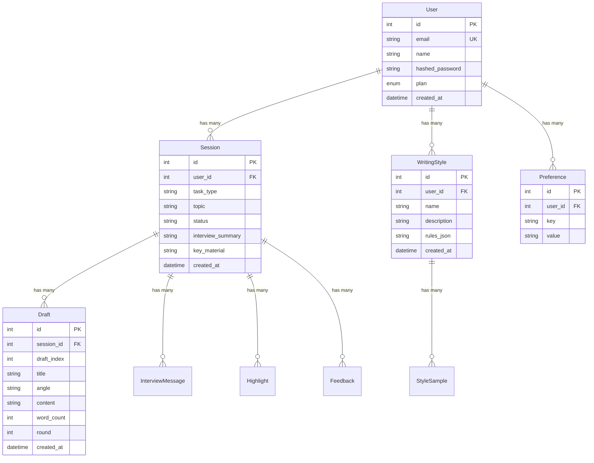

## Enhancement Summary

**Deepened on:** 2026-02-18
**Review agents used:** Security Sentinel, Architecture Strategist, Performance Oracle, Kieran Python Reviewer, Kieran TypeScript Reviewer, Data Integrity Guardian, Code Simplicity Reviewer
**Research sources:** Context7 (SvelteKit, FastAPI), best-practices researcher

### Key Changes From Deepening

1. **JWT validated locally in hooks.server.ts** using `jose` library — eliminates per-request HTTP round-trip to backend (was 3-7ms overhead per page load)
2. **Simplified scope** — removed Phase 5 (My Content), billing API, password reset, and 3 YAGNI fields from User model (~500 LOC not written)
3. **Fixed critical db.py issues** — WAL mode, foreign key enforcement, cascade deletes, schema version check
4. **Fixed auth dependency** — proper session injection via `Depends(get_db)`, exception handling, StrEnum for plan
5. **CSRF middleware added** — Origin header validation on all mutating REST requests
6. **Shared User type** — `$lib/types/user.ts` with union plan type, typed `PageData`
7. **Route matching via `event.route.id`** instead of fragile PUBLIC_ROUTES string array
8. **Argon2id runs in thread pool** — prevents 100-200ms event loop blocking on login/register

### Scope Reductions (Simplicity Review)

| Removed | Reason |
|---|---|
| `email_verified` field | No email service; nothing checks it |
| `is_active` field | No admin panel, no suspension flow |
| `updated_at` field | Nothing reads it; won't auto-update without extra code |
| Phase 5: "My Content" (Document model, 4 endpoints, UI) | AI doesn't use documents yet — pure YAGNI |
| `api/billing.py` (3 endpoints) | Plans are a frontend constant; no Stripe to call |
| `get_optional_user` dependency | No mixed-auth endpoints exist |
| Password reset (2 endpoints + 2 pages) | No email service; console-log tokens aren't a real flow |
| `handleFetch` in hooks.server.ts | App pages are SPA (ssr=false); no SSR API calls |
| Separate `/pricing` route | Anchor link to `/#pricing` on landing page suffices |
| Settings "Danger zone" (account deletion) | Requires cascade cleanup logic for a feature nobody needs yet |

---

# SaaS Boilerplate — Auth, Users, Dashboard, Payments, Landing Page

## Overview

Add the SaaS layer to Inkwell: user authentication, an authenticated dashboard, user-scoped session histories, plan infrastructure, and a public landing page. The existing writing workflow (interview → drafts → highlight → synthesize) remains unchanged but becomes user-scoped.

## Problem Statement

Inkwell currently has no concept of users. All sessions are anonymous, all data is globally accessible, and there's no way to gate features by plan. Before launching to real users, we need:

- **Auth**: Registration, login, logout
- **Data isolation**: Every session, style, and upload belongs to a user
- **SaaS infrastructure**: Plan field on user, pricing section on landing page
- **Marketing**: A landing page to convert visitors into users

## Technical Approach

### Architecture Decisions

| Decision | Choice | Rationale |
|---|---|---|
| Auth mechanism | JWT in httpOnly cookies | XSS-safe, SSR-compatible, no session store needed |
| JWT validation (frontend) | Decode locally with `jose` in hooks.server.ts | Eliminates HTTP round-trip to backend on every page load |
| Password hashing | Argon2id via `pwdlib` | OWASP 2026 recommendation; FastAPI's official choice |
| JWT library (backend) | `PyJWT` | Lightweight, well-maintained |
| CSRF protection | `SameSite=Lax` + Origin header middleware on all mutating REST requests | Double protection: cookie policy + server validation |
| Token strategy | Single 24h JWT with user claims embedded | Long-lived for writing sessions; claims avoid DB lookups on every request |
| WebSocket auth | Validate JWT from cookie during handshake | Browser auto-sends cookies on WS upgrade; reject with 4001 if invalid |
| Route protection | SvelteKit `hooks.server.ts` with `event.route.id` | Type-safe route group matching, no string array maintenance |
| Route groups | `(marketing)` (public, SSR) + `(app)` (authenticated, SPA) | SEO for landing page, SPA for app |
| Migration | Schema version check + auto-wipe | `PRAGMA user_version` detects drift; `create_all()` for fresh DB |
| DB session management | Generator dependency with `yield` | Guarantees cleanup + rollback on exceptions |
| Foreign keys | `PRAGMA foreign_keys = ON` + `ondelete="CASCADE"` on all FKs | Enforced referential integrity; automatic cascade cleanup |
| Plan field | `StrEnum` on User model | Type-safe, prevents typos, serializes cleanly |

### Implementation Phases

#### Phase 1: Backend Foundation (db.py + User model + Auth)

**Critical: Fix db.py first.** The existing database setup has three issues that must be resolved before adding auth:

```python
# db.py — enhanced version

from sqlalchemy import event

SCHEMA_VERSION = 2  # Bump when models change

engine = create_engine(f"sqlite:///{DB_PATH}", echo=False)

@event.listens_for(engine, "connect")
def _set_sqlite_pragmas(dbapi_conn, connection_record):
    cursor = dbapi_conn.cursor()
    cursor.execute("PRAGMA foreign_keys = ON")
    cursor.execute("PRAGMA journal_mode = WAL")
    cursor.execute("PRAGMA busy_timeout = 5000")
    cursor.execute("PRAGMA synchronous = NORMAL")
    cursor.close()

def create_tables() -> None:
    DATA_DIR.mkdir(parents=True, exist_ok=True)

    # Schema version check — auto-wipe stale DB
    if DB_PATH.exists():
        import sqlite3
        conn = sqlite3.connect(str(DB_PATH))
        current = conn.execute("PRAGMA user_version").fetchone()[0]
        conn.close()
        if current < SCHEMA_VERSION:
            DB_PATH.unlink()
            logger.warning("Schema %d < %d — deleted stale database", current, SCHEMA_VERSION)

    # Import all models so SQLModel registers them
    from proof_editor.models import (
        draft, feedback, highlight, interview_message,
        preference, session, style, user,
    )
    SQLModel.metadata.create_all(engine)

    # Stamp version
    import sqlite3
    with sqlite3.connect(str(DB_PATH)) as conn:
        conn.execute(f"PRAGMA user_version = {SCHEMA_VERSION}")

@contextmanager
def get_db() -> Generator[Session, None, None]:
    """Database session with guaranteed cleanup and rollback on error."""
    session = Session(engine)
    try:
        yield session
    except Exception:
        session.rollback()
        raise
    finally:
        session.close()
```

**New files:**

```
backend/src/proof_editor/
├── models/user.py     # User model (SQLModel)
├── api/auth.py        # Register, login, logout, me
└── auth_deps.py       # get_current_user() dependency
```

**`models/user.py`:**

```python
from enum import StrEnum
from pydantic import field_validator

class Plan(StrEnum):
    FREE = "free"
    PRO = "pro"
    TEAM = "team"

class User(SQLModel, table=True):
    id: int | None = Field(default=None, primary_key=True)
    email: str = Field(unique=True, index=True)
    name: str
    hashed_password: str
    plan: Plan = Field(default=Plan.FREE)
    created_at: datetime = Field(default_factory=lambda: datetime.now(UTC))

    @field_validator("email", mode="before")
    @classmethod
    def normalize_email(cls, v: str) -> str:
        return v.strip().lower()

class UserCreate(SQLModel):
    """Registration form input."""
    email: str
    name: str
    password: str

class UserRead(SQLModel):
    """API response — never includes password hash."""
    id: int
    email: str
    name: str
    plan: Plan
    created_at: datetime
```

**`auth_deps.py`:**

```python
from asyncio import to_thread

import jwt
from jwt.exceptions import InvalidTokenError
from fastapi import Depends, HTTPException, Request
from sqlmodel import Session

from proof_editor.db import get_db
from proof_editor.models.user import User

SECRET_KEY = ""  # Loaded from env at startup
JWT_ALGORITHM = "HS256"

def get_current_user(
    request: Request,
    db: Session = Depends(get_db),
) -> User:
    """Extract user from httpOnly cookie JWT. 401 if missing/invalid."""
    token = request.cookies.get("access_token")
    if not token:
        raise HTTPException(status_code=401, detail="Not authenticated")
    try:
        payload = jwt.decode(token, SECRET_KEY, algorithms=[JWT_ALGORITHM])
        user_id = int(payload["sub"])
    except (InvalidTokenError, KeyError, ValueError) as exc:
        raise HTTPException(status_code=401, detail="Invalid token") from exc

    user = db.get(User, user_id)
    if not user:
        raise HTTPException(status_code=401, detail="Not authenticated")
    return user
```

**Auth endpoints (`api/auth.py`):**

| Endpoint | Method | Purpose |
|---|---|---|
| `/api/auth/register` | POST | Create account, auto-login (set cookie) |
| `/api/auth/login` | POST | Validate credentials, set cookie |
| `/api/auth/logout` | POST | Delete cookie |
| `/api/auth/me` | GET | Return current user profile (response_model=UserRead) |

**Security details:**

- Timing-attack prevention: hash a dummy password when user not found
- Password requirements: minimum 8 characters (Pydantic validator on UserCreate)
- Cookie: `httponly=True`, `samesite="lax"`, `secure=True` (except dev), `max_age=86400`, `path="/"`
- Login error: generic "Invalid credentials" (no email enumeration)
- Email normalized to lowercase before storage and lookup
- JWT claims include `sub` (user_id), `email`, `name`, `plan` — so hooks.server.ts can decode locally
- Argon2id operations run in `await to_thread()` to prevent event loop blocking (100-200ms per hash)
- JWT_SECRET_KEY validated at startup: `if len(SECRET_KEY) < 32: raise RuntimeError(...)`
- CORS origins loaded from `CORS_ORIGINS` environment variable

**CSRF middleware (add to main.py):**

```python
@app.middleware("http")
async def csrf_middleware(request: Request, call_next):
    if request.method in ("POST", "PUT", "DELETE", "PATCH"):
        origin = request.headers.get("origin", "")
        if origin and origin not in ALLOWED_ORIGINS:
            return JSONResponse(status_code=403, content={"detail": "CSRF rejected"})
    return await call_next(request)
```

**Modify existing models — add user_id with CASCADE:**

All foreign keys use `sa_column` with `ondelete="CASCADE"`:

```python
# models/session.py
from sqlalchemy import Column, Integer, ForeignKey

class Session(SQLModel, table=True):
    # ... existing fields ...
    user_id: int = Field(
        sa_column=Column(Integer, ForeignKey("user.id", ondelete="CASCADE"), index=True, nullable=False)
    )
```

Apply same pattern to:
- `WritingStyle.user_id` → `CASCADE`
- `Draft.session_id` → `CASCADE`
- `Highlight.session_id` → `CASCADE`
- `InterviewMessage.session_id` → `CASCADE`
- `StyleSample.style_id` → `CASCADE`
- `Preference` → add `user_id` FK with `CASCADE`
- `Feedback.session_id` → `CASCADE`

**Modify existing endpoints — scope to user:**

1. **`api/sessions.py`**: Add `user: User = Depends(get_current_user)` to all endpoints. Filter list by `user_id`. Verify ownership on get/resume: `if session.user_id != user.id: raise HTTPException(404)`.
2. **`api/styles.py`**: Same — scope all queries to `user_id`. Child resources (StyleSample) verified through parent.
3. **`api/voice.py`**: Add user dependency. Make rate limit per-user (replace global `_last_token_time` with per-user dict).

**Modify WebSocket (main.py):**

```python
@app.websocket("/ws")
async def websocket_endpoint(websocket: WebSocket) -> None:
    # Auth: extract JWT from cookie before accepting
    token = websocket.cookies.get("access_token")
    if not token:
        await websocket.close(code=4001, reason="Not authenticated")
        return
    try:
        payload = jwt.decode(token, SECRET_KEY, algorithms=[JWT_ALGORITHM])
        user_id = int(payload["sub"])
    except (InvalidTokenError, KeyError, ValueError):
        await websocket.close(code=4001, reason="Invalid token")
        return

    # Origin check (existing)
    origin = websocket.headers.get("origin", "")
    if origin not in ALLOWED_ORIGINS:
        await websocket.close(code=4003, reason="Origin not allowed")
        return

    await websocket.accept()
    orchestrator = Orchestrator(websocket, user_id=user_id)  # Pass user_id
    # ... rest unchanged
```

**Modify orchestrator.py:**
- Constructor: `def __init__(self, websocket, user_id: int)`
- `handle_task_select`: set `session.user_id = self.user_id`
- `handle_resume`: verify `session.user_id == self.user_id`, reject with error if not

**New backend dependencies:**
```bash
cd backend && uv add pyjwt "pwdlib[argon2]"
```

#### Phase 2: Frontend Route Restructuring

**New route structure:**

```
frontend/src/routes/
├── (marketing)/
│   ├── +layout.svelte          # Marketing layout: navbar + footer, no sidebar
│   ├── +page.svelte            # Landing page (/) with pricing section
│   ├── login/
│   │   ├── +page.svelte        # Login form
│   │   └── +page.server.ts     # Form action: POST to backend, set cookie
│   └── register/
│       ├── +page.svelte        # Registration form
│       └── +page.server.ts     # Form action: POST to backend, set cookie
├── (app)/
│   ├── +layout.svelte          # App layout: sidebar + topbar
│   ├── +layout.ts              # ssr = false for entire app group
│   ├── +layout.server.ts       # Pass user data to all app pages
│   ├── +page.svelte            # Redirect to /dashboard
│   ├── dashboard/
│   │   └── +page.svelte        # User's session list + "New session" CTA
│   ├── session/
│   │   └── [id]/
│   │       └── +page.svelte    # Writing workflow (interview/drafts/highlight)
│   ├── settings/
│   │   └── +page.svelte        # Profile + password change
│   └── styles/
│       ├── +page.svelte        # Style list (existing StyleManager)
│       └── [id]/
│           └── +page.svelte    # Style editor (existing StyleEditor)
├── +layout.svelte              # Root layout (fonts, global CSS)
└── +layout.server.ts           # Root: pass user from locals (may be null)
```

**Key new files:**

```
frontend/src/
├── hooks.server.ts             # Auth guard with local JWT decode
├── app.d.ts                    # Type Locals and PageData
└── lib/
    ├── types/
    │   └── user.ts             # Shared User interface
    └── components/
        ├── MarketingNav.svelte # Top nav for marketing pages
        ├── Footer.svelte       # Marketing footer
        └── PricingCards.svelte  # Pricing section (used on landing page)
```

**`$lib/types/user.ts` — shared type:**

```typescript
export interface User {
    id: number;
    email: string;
    name: string;
    plan: 'free' | 'pro' | 'team';
}

export type UserPlan = User['plan'];
```

**`app.d.ts`:**

```typescript
import type { User } from '$lib/types/user';

declare global {
    namespace App {
        interface Locals {
            user: User | null;
        }
        interface PageData {
            user: User | null;
        }
    }
}

export {};
```

**`hooks.server.ts` — local JWT validation (no backend round-trip):**

```typescript
import { redirect, type Handle } from '@sveltejs/kit';
import { jwtVerify } from 'jose';
import { env } from '$env/dynamic/private';
import type { User } from '$lib/types/user';

const JWT_SECRET = new TextEncoder().encode(env.JWT_SECRET_KEY ?? '');

export const handle: Handle = async ({ event, resolve }) => {
    const token = event.cookies.get('access_token');

    if (token) {
        try {
            const { payload } = await jwtVerify(token, JWT_SECRET);
            event.locals.user = {
                id: Number(payload.sub),
                email: payload.email as string,
                name: payload.name as string,
                plan: payload.plan as User['plan'],
            };
        } catch {
            event.locals.user = null;
            event.cookies.delete('access_token', { path: '/' });
        }
    } else {
        event.locals.user = null;
    }

    // Route group based matching — no string array needed
    const routeId = event.route.id ?? '';
    const isAppRoute = routeId.startsWith('/(app)');

    if (isAppRoute && !event.locals.user) {
        const returnTo = encodeURIComponent(event.url.pathname);
        redirect(303, `/login?returnTo=${returnTo}`);
    }

    const isAuthRoute = routeId.startsWith('/(marketing)/login')
        || routeId.startsWith('/(marketing)/register');
    if (isAuthRoute && event.locals.user) {
        redirect(303, '/dashboard');
    }

    return resolve(event);
};
```

**Login form action (`/(marketing)/login/+page.server.ts`):**

```typescript
import { fail, redirect } from '@sveltejs/kit';
import type { Actions } from './$types';
import { INTERNAL_API_URL } from '$env/static/private';

export const actions = {
    default: async ({ request, cookies, url }) => {
        const form = await request.formData();
        const email = form.get('email');
        const password = form.get('password');

        if (typeof email !== 'string' || typeof password !== 'string') {
            return fail(400, { email: email?.toString() ?? '', error: 'All fields required' });
        }

        const res = await fetch(`${INTERNAL_API_URL}/api/auth/login`, {
            method: 'POST',
            headers: { 'Content-Type': 'application/json' },
            body: JSON.stringify({ email, password }),
        });

        if (!res.ok) {
            return fail(401, { email, error: 'Invalid credentials' });
        }

        // Backend returns token in JSON; we set the cookie server-side
        const { token } = await res.json();
        cookies.set('access_token', token, {
            path: '/',
            httpOnly: true,
            sameSite: 'lax',
            secure: true,
            maxAge: 86400,
        });

        // Validate returnTo — prevent open redirect
        const returnTo = url.searchParams.get('returnTo');
        const target = returnTo && returnTo.startsWith('/') && !returnTo.startsWith('//')
            && !returnTo.includes('\\')
            ? returnTo
            : '/dashboard';

        redirect(303, target);
    },
} satisfies Actions;
```

**IMPORTANT: Remove existing root `+page.ts`** (`export const ssr = false`). SSR control is now per-group: `(app)/+layout.ts` has `export const ssr = false`, marketing pages use SSR by default.

**Frontend dependencies:**
```bash
cd frontend && npm install jose
```

**Config update — use environment variables:**

```typescript
// $lib/config.ts
import { PUBLIC_API_URL, PUBLIC_WS_URL } from '$env/static/public';

export const BASE_API_URL = PUBLIC_API_URL || 'http://localhost:8000';
export const BASE_WS_URL = PUBLIC_WS_URL || 'ws://localhost:8000/ws';
```

**WebSocket reconnect — handle auth expiry:**

In `ws.svelte.ts`, handle 4001 close code:
```typescript
this.ws.onclose = (event: CloseEvent) => {
    this._connected = false;
    if (event.code === 4001) {
        // Auth expired — redirect, don't reconnect
        window.location.href = '/login?returnTo=' + encodeURIComponent(window.location.pathname);
        return;
    }
    // ... existing reconnect logic
};
```

**User state propagation:** Use SvelteKit's page data flow, not a global store:

```typescript
// Root +layout.server.ts
export const load = ({ locals }) => ({ user: locals.user });

// In any component:
// let { data } = $props();  → data.user is typed via PageData
```

#### Phase 3: Landing Page

Single-page marketing site at `/` with these sections:

1. **Hero**: "Your AI writing partner that learns your voice" + "Start Writing Free" CTA
2. **How It Works**: 4-step visual (Describe → Interview → Choose Angle → Refine)
3. **Features**: 3-4 cards (AI Interview, 3 Draft Angles, Style Learning, Voice Input)
4. **Pricing** (`#pricing` anchor): Embedded `PricingCards` component (Free / Pro / Team). Free CTA → `/register`. Paid CTAs → "Coming Soon" waitlist modal.
5. **Final CTA**: "Ready to write something great?" + register button
6. **Footer**: Links (About, Privacy, Terms), copyright

Design language: existing dark chrome + warm paper aesthetic. `--chrome`, `--paper`, `--accent` CSS custom properties. Fonts: Newsreader (headings/logo) + Outfit (body).

**Pricing data is a frontend constant** in `PricingCards.svelte`:
```typescript
const plans = [
    { name: 'Free', key: 'free', price: 0, features: ['5 sessions/month', '3 draft angles', 'Style preferences'] },
    { name: 'Pro', key: 'pro', price: 19, features: ['Unlimited sessions', 'Voice input', 'Advanced style learning', 'Priority AI'] },
    { name: 'Team', key: 'team', price: 49, features: ['Everything in Pro', '5 team members', 'Shared styles', 'Admin dashboard'] },
];
```

#### Phase 4: Dashboard + Session Management

**Dashboard (`/(app)/dashboard/+page.svelte`):**

- Card grid of user's sessions (fetched client-side from `/api/sessions`)
- Each card: task type badge, topic, date, draft count, status indicator
- "New Session" prominent CTA card
- Empty state: "Start your first writing session"
- Click card → navigate to `/session/{id}`

**Session page (`/(app)/session/[id]/+page.svelte`):**

- Move current writing workflow UI here (Interview, DraftComparison, etc.)
- WebSocket connects on mount at `(app)` layout level, disconnects on destroy
- Sidebar shows session list scoped to user
- "New session" creates session and navigates to `/session/{newId}`

**WebSocket lifecycle:** Managed at `(app)/+layout.svelte` level so it persists across app navigation. Message handlers bound at the session page level (`session/[id]/+page.svelte`).

#### Phase 5: Settings

**Settings page (`/(app)/settings/+page.svelte`):**

- **Profile section**: Name (editable), email (read-only), member since date
- **Password section**: Change password form (current + new + confirm)
- **Plan section**: Current plan display with badge, "Upgrade" link → `/#pricing`

## ERD



## Acceptance Criteria

### Functional Requirements

- [x] New users can register with email + password + name
- [x] Registered users can log in and receive an httpOnly JWT cookie
- [x] Logged-in users are redirected from `/login` and `/register` to `/dashboard`
- [x] Unauthenticated users are redirected from `/(app)/*` routes to `/login?returnTo=...`
- [x] After login, users are redirected to the `returnTo` URL (if relative) or `/dashboard`
- [x] Users can log out (cookie cleared, redirected to `/`)
- [x] Dashboard shows only the current user's sessions
- [x] "New session" creates a session owned by the current user
- [x] `session.resume` over WebSocket rejects sessions not owned by the current user
- [x] WebSocket connections without a valid JWT cookie are rejected (code 4001)
- [x] WebSocket 4001 close triggers redirect to `/login` (no infinite reconnect loop)
- [x] Landing page renders at `/` with hero, how-it-works, features, pricing, CTA, footer
- [x] Pricing section shows Free / Pro / Team; Free CTA → register, paid → "Coming Soon" modal
- [x] Settings page shows profile (editable name), password change, current plan
- [x] All existing REST endpoints (`/api/sessions`, `/api/styles`) are scoped to the current user
- [x] Child resources (drafts, highlights, style samples) verified through parent ownership
- [x] The `User.plan` field defaults to `Plan.FREE` on registration

### Non-Functional Requirements

- [x] Passwords hashed with Argon2id (via `pwdlib`), hashing runs in `to_thread()`
- [x] JWT secret loaded from `JWT_SECRET_KEY` env var; startup validates length >= 32
- [x] JWT claims include `sub`, `email`, `name`, `plan` for frontend local decode
- [x] No email enumeration via login responses (generic "Invalid credentials")
- [x] `returnTo` validated: must start with `/`, not `//`, no backslashes
- [x] Landing page is server-side rendered (SSR) for SEO
- [x] App pages are SPA (`ssr = false` at `(app)/+layout.ts`)
- [x] CORS origins loaded from `CORS_ORIGINS` environment variable
- [x] CSRF middleware validates Origin header on all POST/PUT/DELETE/PATCH requests
- [x] SQLite: WAL mode, foreign keys ON, busy_timeout 5000ms
- [x] All FKs have `ondelete="CASCADE"`
- [x] Email normalized to lowercase before storage
- [x] Schema version check on startup — auto-wipe stale DB
- [x] Backend API URLs from `$env/static/private` (server-side), `$env/static/public` (client-side)

### Quality Gates

- [x] `ruff check --fix && ruff format` passes
- [x] `pytest` passes (add tests for auth endpoints — register, login, logout, me)
- [x] `npm run check` passes (Svelte type checking)
- [x] All new backend endpoints have at least one happy-path test

## Dependencies & Prerequisites

- **Backend packages**: `pyjwt`, `pwdlib[argon2]` (add via `uv add`)
- **Frontend packages**: `jose` (add via `npm install jose`)
- **Environment variables**: `JWT_SECRET_KEY` (generate: `openssl rand -hex 32`), `CORS_ORIGINS`, `INTERNAL_API_URL`, `PUBLIC_API_URL`, `PUBLIC_WS_URL`
- **No new infrastructure**: SQLite stays, no Redis/Postgres/email service needed
- **DB wipe required**: Existing `proof_editor.db` must be deleted (schema version auto-wipe handles this)

## Risk Analysis & Mitigation

| Risk | Impact | Mitigation |
|---|---|---|
| Token expiry during long writing session | User loses work mid-draft | 24h token lifetime; WS 4001 handler redirects to login |
| SQLite concurrent writes under multi-user | Slow writes, potential locks | WAL mode + busy_timeout=5000ms + synchronous=NORMAL |
| Breaking existing WebSocket flow with auth | Core feature regresses | Auth is additive — validated in handshake, then Orchestrator works as before |
| Stale JWT claims after profile/plan change | User sees old name/plan in nav | Acceptable for 24h window; force re-login on plan change if needed later |
| Frontend route restructuring breaks existing UI | Core feature regresses | Move code carefully; existing components (Interview, DraftComparison, etc.) are unchanged |
| Integer ID enumeration on sessions | Cross-user data access | All endpoints verify `session.user_id == current_user.id`; return 404 not 403 |

## References

### Internal References

- Existing Session model: `backend/src/proof_editor/models/session.py`
- Existing Draft model: `backend/src/proof_editor/models/draft.py`
- WebSocket handler: `backend/src/proof_editor/main.py:73`
- Orchestrator: `backend/src/proof_editor/agent/orchestrator.py`
- Session API: `backend/src/proof_editor/api/sessions.py`
- Style API: `backend/src/proof_editor/api/styles.py`
- Voice/Upload API: `backend/src/proof_editor/api/voice.py`
- GCS storage: `backend/src/proof_editor/storage.py`
- Database setup: `backend/src/proof_editor/db.py`
- Frontend config: `frontend/src/lib/config.ts`
- Current page shell: `frontend/src/routes/+page.svelte`
- Sidebar: `frontend/src/lib/components/Sidebar.svelte`
- WebSocket client: `frontend/src/lib/ws.svelte.ts`
- MVP brainstorm: `docs/brainstorms/2026-02-16-mvp-brainstorm.md`

### External References

- FastAPI JWT tutorial: https://fastapi.tiangolo.com/tutorial/security/oauth2-jwt/
- pwdlib (Argon2 for FastAPI): https://www.francoisvoron.com/blog/introducing-pwdlib-a-modern-password-hash-helper-for-python
- SvelteKit hooks (auth guard): https://svelte.dev/docs/kit/hooks
- SvelteKit protected routes (don't use +layout.server.ts): https://gebna.gg/blog/protected-routes-svelte-kit
- SvelteKit cookie auth: https://joyofcode.xyz/sveltekit-authentication-using-cookies
- jose (JWT for JavaScript): https://github.com/panva/jose
