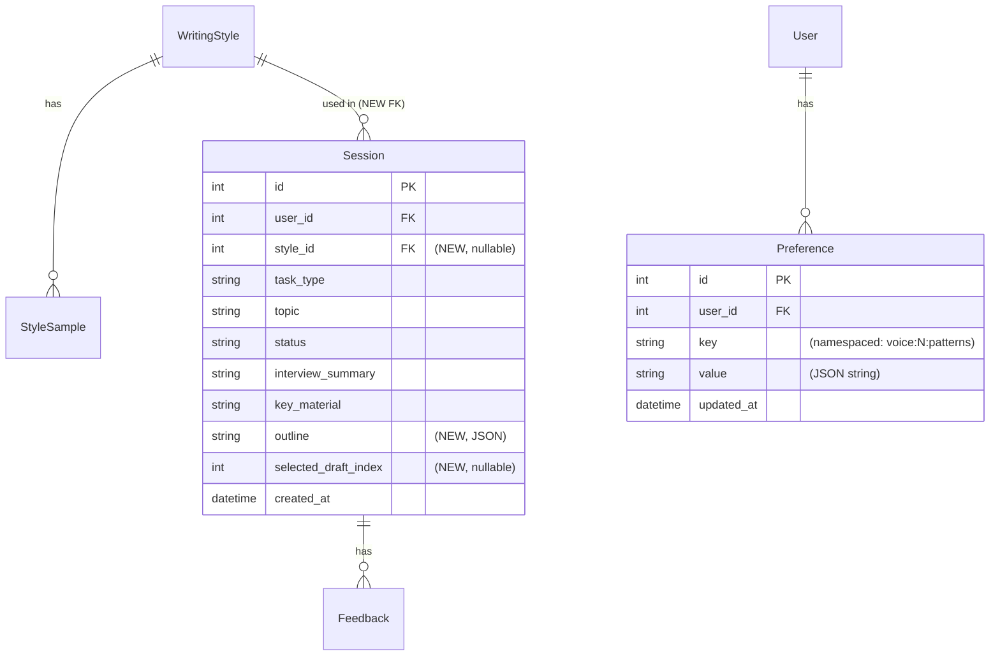

# feat: Writing Flywheel + Outline Phase

## Overview

Transforms Inkwell from a stateless draft generator into a learning writing partner. Two interlocking features:

1. **Outline Phase** — a new `outline` workflow state between Interview and Draft. The AI generates a structural skeleton of nodes (Hook, Story, Point, Evidence, etc.) grounded in interview material. The user drags to reorder, edits node descriptions, and confirms. The confirmed outline is passed directly into draft generation, giving all three drafts explicit structure instead of angle-only guidance.

2. **Writing Flywheel** — a per-user `VoiceProfile` that compounds over time. LLM analyzes writing samples ("What do you notice?"), session feedback (accepted/rejected suggestions, highlight sentiments, draft selection) is distilled into structured preferences, and the synthesized profile is injected into editorial comments, draft generation, synthesis, and the interview. Every session makes the system smarter about the user's voice.

### Updated Workflow

```
TASK → INTERVIEW → OUTLINE → DRAFT → HIGHLIGHT → SYNTHESIZE → FOCUS → [DISTILL]
                      ↑ new                                              ↑ new
                                                                ↗
                                               VOICE PROFILE ──→ injected into all LLM calls
                                                    ↑
                                          SAMPLE ANALYSIS (REST)
```

---

## Problem Statement

**Today, every session starts cold.** The interviewer asks generic questions. The drafts reflect no knowledge of the user's voice, structural preferences, or past behavior. Editorial comments are boilerplate grammar advice. Accept/reject signals and highlight sentiments are stored in the database but read by nothing.

**The outline gap:** The workflow jumps from "interview gathered material" to "three finished drafts." There is no moment where the writer decides how to structure the piece. The AI picks structure implicitly through angle labels. The user has no creative input on architecture before committing to a draft.

**The flywheel gap:** The `learning/` module is empty. The `Preference` model is never written to. The `Feedback` table is never read back. `style_id` from `TaskSelect` is ignored by the orchestrator. The `examples_context` slot in both the draft generator and synthesizer pulls from static `inspo/` files rather than the user's actual writing.

---

## Technical Approach

### Architecture

```
backend/src/proof_editor/
├── learning/
│   ├── __init__.py              (currently empty → populate)
│   ├── pattern_extractor.py     (NEW — LLM "what do you notice?" on StyleSamples)
│   ├── outline_generator.py     (NEW — LLM structural node generation from interview)
│   └── feedback_distiller.py   (NEW — distill session signals → voice profile)
├── agent/
│   └── orchestrator.py          (add "outline" state + handler)
├── drafting/
│   ├── prompts.py               (add {outline_context} slot)
│   └── generator.py             (accept outline param)
├── style/
│   └── editorial.py             (add voice_profile_context param)
├── models/
│   └── session.py               (add style_id FK + outline JSON column)
└── api/
    └── styles.py                (add /analyze + /voice_profile endpoints)

frontend/src/lib/
├── components/
│   ├── OutlineScreen.svelte     (NEW — draggable node editor)
│   └── OutlineNode.svelte       (NEW — single draggable card)
├── stores/
│   └── session.svelte.ts        (add 'outline' screen)
└── ws-handler.ts                (add outline.* message handlers)
```

### Database changes

Two columns added to existing tables (SCHEMA_VERSION bump required — project uses wipe-and-recreate, no migrations):

```python
class Session(SQLModel, table=True):
    style_id: int | None = Field(default=None, foreign_key="writing_style.id")
    outline: str = Field(default="[]")  # JSON: list[OutlineNode dict]
    selected_draft_index: int | None = None  # which draft user took to focus
```

No new tables needed. VoiceProfile data lives in the existing `Preference` table with namespaced keys:
- `"voice:{style_id}:patterns"` → JSON string of extracted patterns
- `"voice:{style_id}:red_flags"` → JSON list of writer weaknesses
- `"voice:{style_id}:structural_signature"` → JSON description of typical structure
- `"voice:{style_id}:analyzed_at"` → ISO timestamp of last analysis run

### ERD (changes only)



---

## Implementation Phases

### Phase 1 — Wire style_id + immediate voice injection (high ROI, low risk)

**Goal:** Stop ignoring `style_id`. Load the user's writing samples and inject them into the `{examples_context}` slot that already exists in both the draft generator and synthesizer. Add voice profile context to editorial comments.

**Backend tasks:**

1. **`orchestrator.py`** — store `style_id` from `TaskSelect`:
   ```python
   # handle_task_select
   self.style_id = msg.style_id
   # persist to session row
   session.style_id = self.style_id
   ```

2. **`models/session.py`** — add `style_id` FK + `outline` + `selected_draft_index` columns; bump `SCHEMA_VERSION`

3. **`learning/__init__.py`** — add `format_samples_for_prompt(samples: list[StyleSample]) -> str`:
   ```python
   def format_samples_for_prompt(samples):
       if not samples:
           return ""
       joined = "\n\n---\n\n".join(
           f"SAMPLE: {s.title or 'Untitled'}\n{s.content[:2000]}"
           for s in samples[:3]
       )
       return f"WRITING SAMPLES (match this voice and style):\n{joined}"
   ```

4. **`orchestrator._start_drafting()`** — load samples before DraftGenerator init:
   ```python
   examples_context = ""
   if self.style_id:
       with db_session() as db:
           samples = db.exec(select(StyleSample).where(...)).all()
       examples_context = format_samples_for_prompt(samples)
   else:
       examples_context = format_examples_for_prompt(load_examples())
   ```
   Pass `examples_context` to `DraftGenerator` and `DraftSynthesizer`.

5. **`style/editorial.py`** — add `voice_profile_context: str = ""` to `generate_comments()`:
   ```python
   SYSTEM_PROMPT = """\
   You are a senior editor reviewing a draft. {voice_context_section}
   Leave 3-5 editorial comments focused on structure, clarity, voice, and impact.
   ...
   """
   # If voice_profile_context provided, replace {voice_context_section} with:
   # "You know this writer's voice well: {voice_profile_context}"
   ```

**Frontend tasks:** None for Phase 1.

---

### Phase 2 — Pattern extraction ("What do you notice?")

**Goal:** Add a REST endpoint that triggers LLM analysis of all StyleSamples for a given style, extracts structured patterns, and stores them in the `Preference` table. The voice profile summary then gets injected alongside the raw samples.

**New file: `learning/pattern_extractor.py`**

```python
EXTRACTOR_PROMPT = """\
You are a writing coach analyzing a writer's body of work.
Read these writing samples and identify the writer's patterns.

Use the extract_voice_profile tool to report your findings."""

EXTRACTOR_TOOLS = [{
    "type": "function",
    "function": {
        "name": "extract_voice_profile",
        "parameters": {
            "type": "object",
            "properties": {
                "voice_descriptors": {
                    "type": "array",
                    "items": {"type": "string"},
                    "description": "3-5 phrases describing the writer's distinctive voice"
                },
                "structural_signature": {
                    "type": "string",
                    "description": "How this writer typically structures a piece (opening → body → close)"
                },
                "red_flags": {
                    "type": "array",
                    "items": {"type": "string"},
                    "description": "Recurring weaknesses or habits the writer should watch"
                },
                "strengths": {
                    "type": "array",
                    "items": {"type": "string"},
                    "description": "Patterns that consistently work well and should be enhanced"
                }
            },
            "required": ["voice_descriptors", "structural_signature", "red_flags", "strengths"]
        }
    }
}]

async def extract_patterns(style_id: int, samples: list[StyleSample]) -> dict:
    """Run 'What do you notice?' LLM call over StyleSamples."""
    ...
    # Returns structured dict matching tool schema
```

**New API endpoints in `api/styles.py`:**
- `POST /api/styles/{style_id}/analyze` — triggers extraction, stores in `Preference`, returns the profile
- `GET /api/styles/{style_id}/voice_profile` — reads stored profile from `Preference`

**Updated `orchestrator._start_drafting()`:**
```python
# After loading samples, check for stored voice profile
voice_profile = load_voice_profile(user_id, style_id)  # from Preference table
if voice_profile:
    examples_context = format_voice_profile_for_prompt(voice_profile) + "\n\n" + raw_samples_context
```

**Frontend tasks:**
- In `StyleManager.svelte`, add an "Analyze writing style" button per style that calls `POST /api/styles/{id}/analyze`
- Show a loading state ("Analyzing your writing..."), then display the extracted patterns as read-only chips/cards
- Each pattern shows its category (Voice / Structure / Red Flags / Strengths)

---

### Phase 3 — Outline phase (new workflow state)

**Goal:** Insert an interactive outline step between the interview and drafting. AI generates structural nodes grounded in interview material. User drags to reorder, edits descriptions, confirms. Confirmed outline shapes all three drafts.

#### New WS message types (`ws_types.py`):

```python
class OutlineNode(BaseModel):
    id: str
    node_type: str   # "hook" | "context" | "thesis" | "story" | "point" |
                     # "evidence" | "complication" | "insight" | "closing"
    description: str  # AI-generated, 1-2 sentence prompt for this section

class OutlineNodes(BaseModel):
    type: str = "outline.nodes"
    nodes: list[OutlineNode]

class OutlineConfirm(BaseModel):
    type: str = "outline.confirm"
    nodes: list[OutlineNode]  # user's reordered/edited version

class OutlineSkip(BaseModel):
    type: str = "outline.skip"
```

#### New file: `learning/outline_generator.py`

```python
OUTLINE_SYSTEM_PROMPT = """\
You are a writing coach. Based on this interview material, generate a
structural outline for the piece. Use the generate_outline tool."""

OUTLINE_TOOLS = [{
    "type": "function",
    "function": {
        "name": "generate_outline",
        "parameters": {
            "type": "object",
            "properties": {
                "nodes": {
                    "type": "array",
                    "items": {
                        "type": "object",
                        "properties": {
                            "node_type": {"type": "string"},
                            "description": {"type": "string"}
                        }
                    }
                }
            }
        }
    }
}]

async def generate_outline(
    task_type: str,
    interview_summary: str,
    key_material: list[str],
    structural_signature: str = "",  # from voice profile
) -> list[OutlineNode]:
    ...
```

#### Orchestrator changes:

```python
# New state: "outline"
# Transition: ready_to_draft → state = "outline" → send outline.nodes
# Transition: outline.confirm → _start_drafting(outline=nodes)
# Transition: outline.skip → _start_drafting(outline=None)

async def _start_outline(self):
    self.state = "outline"
    nodes = await generate_outline(
        self.task_type,
        self.interview_summary,
        self.key_material,
        structural_signature=self.voice_profile.get("structural_signature", ""),
    )
    await self._send(OutlineNodes(nodes=nodes))

async def handle_outline_confirm(self, msg: OutlineConfirm):
    # Persist outline to session
    with db_session() as db:
        session = db.get(Session, self.session_id)
        session.outline = json.dumps([n.dict() for n in msg.nodes])
        db.add(session); db.commit()
    await self._start_drafting(outline=msg.nodes)
```

#### `prompts.py` — add outline slot:

```python
DRAFT_SYSTEM_PROMPT = """\
...
{outline_context}
...
"""

def build_draft_prompt(..., outline_context: str = "") -> str:
    ...
```

When an outline is present, `outline_context` is:
```
STRUCTURE (follow this order):
1. Hook: Open at the moment the user realized their system was broken...
2. Context: Zoom out — why this problem is universal for knowledge workers...
3. Story: The failed demo — what went wrong and what it revealed...
4. Point: The core argument: constraints enable creativity, not just limit it...
5. Evidence: The board game analogy — pieces before strategy...
6. Closing: Reframe — it's not about the tool, it's about the discipline...
```

#### Frontend: `OutlineScreen.svelte`

New screen in the `'outline'` state. Rendered between Interview and DraftComparison.

```
┌─────────────────────────────────────────────────────────┐
│  Here's how I'd structure this piece.                   │
│  Drag to reorder, click to edit any node.               │
│                                              [Skip →]   │
├─────────────────────────────────────────────────────────┤
│  ⠿  [ Hook ]      Open at the moment you tried to...   │
│  ⠿  [ Context ]   Zoom out — why this matters beyond..  │
│  ⠿  [ Thesis ]    Your core argument: AI needs...       │
│  ⠿  [ Story ]     The failed experiment — what went...  │
│  ⠿  [ Evidence ]  The board game analogy...             │
│  ⠿  [ Closing ]   Reframe: discipline over tool choice  │
│                                                         │
│  [+ Add node]                  [Generate drafts →]      │
└─────────────────────────────────────────────────────────┘
```

**Node card anatomy:**
- Left: `⠿` drag handle (cursor: grab)
- Center-left: node type pill (colored by category — Opening=amber, Body=blue, Closing=green)
- Center: description text, inline-editable on click
- Right: `×` delete button

**Node type picker:** Clicking the type pill opens a small popover with all types grouped by category. Can change "Point" to "Complication" etc.

**Drag implementation:** Use `svelte-dnd-action` (lightweight, Svelte 5 compatible) or native HTML5 drag and drop with `$state()` for the node list. No heavy dependencies.

**Sending confirmation:**
```typescript
// ws-handler.ts
function confirmOutline(nodes: OutlineNode[]) {
    ws.send({ type: "outline.confirm", nodes });
    session.setScreen("drafts");
}
```

#### New `'outline'` screen in session store:

```typescript
// stores/session.svelte.ts
type Screen = 'task' | 'interview' | 'outline' | 'drafts' | 'focus';

let outlineNodes = $state<OutlineNode[]>([]);

// ws-handler.ts: handle "outline.nodes" message
case "outline.nodes":
    session.setOutlineNodes(msg.nodes);
    session.setScreen("outline");
    break;
```

---

### Phase 4 — Feedback distillation

**Goal:** After each session, distill the behavioral signals (accepted/rejected suggestions, highlight sentiments, draft selection) into voice profile updates stored in the `Preference` table.

**New file: `learning/feedback_distiller.py`**

```python
async def distill_session_feedback(
    user_id: int,
    style_id: int,
    session_id: int,
) -> None:
    """Read session signals and update voice profile in Preference table."""
    with db_session() as db:
        feedbacks = db.exec(
            select(Feedback).where(Feedback.session_id == session_id)
        ).all()
        highlights = db.exec(
            select(Highlight).where(Highlight.session_id == session_id)
        ).all()
        session = db.get(Session, session_id)

    # Aggregate: which rules were consistently rejected?
    rejected_rules = [f.rule_id for f in feedbacks if not f.accepted and f.rule_id]
    accepted_rules = [f.rule_id for f in feedbacks if f.accepted and f.rule_id]

    # Which sentiment labels did the user apply?
    positive_labels = [h.label for h in highlights if h.sentiment == "like" and h.label]
    negative_labels = [h.label for h in highlights if h.sentiment == "flag" and h.label]

    # LLM distillation call (brief, cheap — haiku tier)
    summary = await _llm_distill(session, feedbacks, highlights)

    # Upsert into Preference
    _upsert_preference(user_id, f"voice:{style_id}:session_learnings", json.dumps({
        "from_session": session_id,
        "rejected_rules": rejected_rules,
        "accepted_rules": accepted_rules,
        "positive_labels": positive_labels,
        "negative_labels": negative_labels,
        "summary": summary,
        "updated_at": datetime.now(UTC).isoformat(),
    }))
```

**Trigger:** Fire-and-forget after `handle_focus_feedback()` in `FocusHandler`, or on `focus.exit`. Use `asyncio.create_task()` so it doesn't block the WS response.

**Draft selection tracking:** When `focus.enter` is received, record `selected_draft_index` on the Session row. Over time this builds up angle preference history in `Preference`:
```python
key = f"voice:{style_id}:angle_preferences"
# Append this session's selected angle to a running tally
```

---

### Phase 5 — Living Style Guide UI (Writing Brain panel)

**Goal:** A dedicated panel where users can see their current inferred voice profile, view patterns by source, and trigger re-analysis.

**Location:** New tab in the existing StyleManager view, or a separate `/styles/{id}/brain` route.

**Sections:**
- **Core Voice** — voice_descriptors as chips
- **Structural Signature** — paragraph description of typical structure
- **Red Flags** — patterns to watch, with "Dismiss" to remove
- **Strengths** — patterns that work, with "Reinforce"
- **Session Learnings** — timeline of recent distillations, each showing source session + what was learned

**"What do you notice?" trigger:**
- After adding 2+ samples to a style, show a card: "Ready to learn from your samples. Run analysis?"
- After completing a session with a style, show: "I noticed some things in this session. See what I learned →"

**The "Add to writing brain" session wrap:**
- When navigating away from focus mode, soft toast: "Save this piece to your writing brain?" with [Save] [Skip]
- [Save] → calls `POST /api/styles/{style_id}/analyze` with the completed draft added as a temporary sample

---

## Acceptance Criteria

### Functional

- [ ] `style_id` from `TaskSelect` is stored on `Session` and used to load `StyleSample` records into `examples_context` for draft generation and synthesis
- [ ] `POST /api/styles/{style_id}/analyze` runs LLM extraction and stores structured patterns in `Preference` table
- [ ] `GET /api/styles/{style_id}/voice_profile` returns stored patterns
- [ ] Voice profile context is injected into `generate_comments()` — editorial comments reference the user's known weaknesses
- [ ] After the interview's `ready_to_draft` signal, orchestrator transitions to `"outline"` state and sends `outline.nodes` WS message
- [ ] Frontend renders the `OutlineScreen` with draggable node cards
- [ ] User can reorder, delete, add, and edit node descriptions
- [ ] Confirming the outline sends `outline.confirm` and transitions to the drafts screen
- [ ] Skipping the outline (`outline.skip`) triggers immediate draft generation with no structural constraint
- [ ] All three generated drafts follow the confirmed outline structure
- [ ] Confirmed outline is persisted to `session.outline` JSON column for session resume
- [ ] Accepted/rejected suggestions are distilled into voice profile updates after `focus.exit`
- [ ] `selected_draft_index` is recorded on Session when `focus.enter` is received

### Non-Functional

- [ ] Outline generation latency < 4 seconds (one LLM call, haiku tier acceptable)
- [ ] Pattern extraction call does not block the WS session (run via REST, not WS)
- [ ] Feedback distillation is fire-and-forget (async background task, no UX impact)
- [ ] SCHEMA_VERSION bumped, DB wipe documented in commit message
- [ ] No `Literal["a", "b"]` in any new SQLModel table columns (use `str` with comments)
- [ ] All new WS message types added to the discriminated union in `ws_types.py`

### Quality Gates

- [ ] `uv run ruff check --fix && uv run ruff format` passes
- [ ] `uv run mypy src/` passes on new files
- [ ] Manual test: full flow — add style + sample → analyze → new session with style → outline → draft → focus → feedback distilled
- [ ] Session resume correctly restores outline from `session.outline` JSON

---

## Dependencies & Prerequisites

- No new Python packages required (LiteLLM already handles tool-calling)
- Frontend: `svelte-dnd-action` for drag-and-drop (`npm install svelte-dnd-action`) or native HTML5 DnD
- Existing `StyleSample` records are the seed — users need at least one sample for voice injection to activate; the feature degrades gracefully to current behavior when no style is selected

---

## Risk Analysis

| Risk | Likelihood | Mitigation |
|------|-----------|------------|
| Outline LLM call fails or returns malformed nodes | Medium | Validate tool call output; fall back to empty outline with "Skip" auto-triggered |
| SCHEMA_VERSION bump wipes production data | High (by design) | Export/backup before deploying; document in CHANGELOG |
| `svelte-dnd-action` + Svelte 5 runes compatibility | Low-Medium | Test in isolation before integrating into full screen; native DnD as fallback |
| Pattern extraction quality too generic | Medium | Prompt engineering + few-shot examples; expose "regenerate" button in UI |
| Feedback distillation LLM call costs at scale | Low (currently) | Use Haiku for distillation; add per-user rate limit |
| Outline adds friction that users skip | Medium | "Skip →" is always visible and easy; skip is never more than one click away |

---

## References

### Internal

- `backend/src/proof_editor/agent/orchestrator.py` — state machine transitions
- `backend/src/proof_editor/drafting/prompts.py:19` — `DRAFT_SYSTEM_PROMPT` with `{examples_context}` slot
- `backend/src/proof_editor/drafting/generator.py` — `DraftGenerator` + `format_examples_for_prompt()`
- `backend/src/proof_editor/drafting/synthesizer.py` — identical `{examples_context}` slot + angle scoring
- `backend/src/proof_editor/style/editorial.py` — `generate_comments()` signature to extend
- `backend/src/proof_editor/models/feedback.py` — accept/reject signal storage (never read back yet)
- `backend/src/proof_editor/models/preference.py` — KV store for voice profile (never written yet)
- `backend/src/proof_editor/models/style.py` — `WritingStyle` + `StyleSample`
- `backend/src/proof_editor/learning/__init__.py` — empty, ready to populate
- `frontend/src/lib/stores/session.svelte.ts` — `Screen` type to extend with `'outline'`
- `frontend/src/lib/ws-handler.ts` — message routing to extend with `outline.*`
- `INSTITUTIONAL_LEARNINGS.md` — gotchas: SQLModel Literal types, TipTap mark timing, WS race conditions

### Related Plans

- `docs/plans/2026-02-19-feat-focus-edit-mode-agent-sidebar-plan.md` — the focus edit mode this builds on
- `docs/plans/2026-02-16-feat-mvp-ai-writing-partner-plan.md` — original workflow architecture

### External

- `svelte-dnd-action` — https://github.com/isaacHagoel/svelte-dnd-action (Svelte 5 compatible)
- LiteLLM tool-calling docs — https://docs.litellm.ai/docs/completion/function_call
